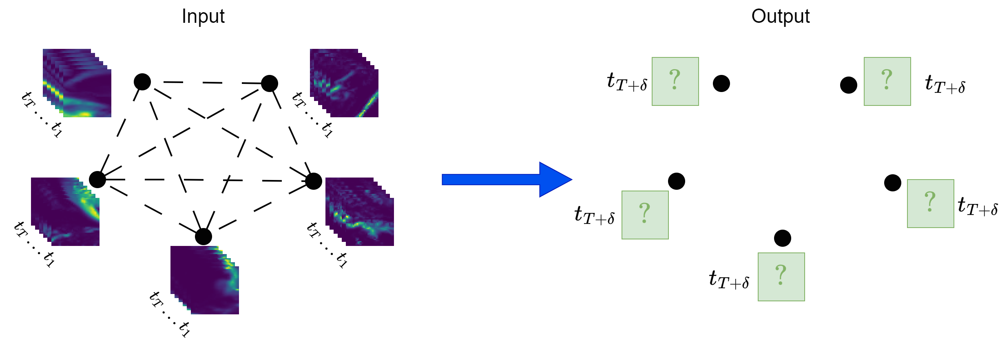
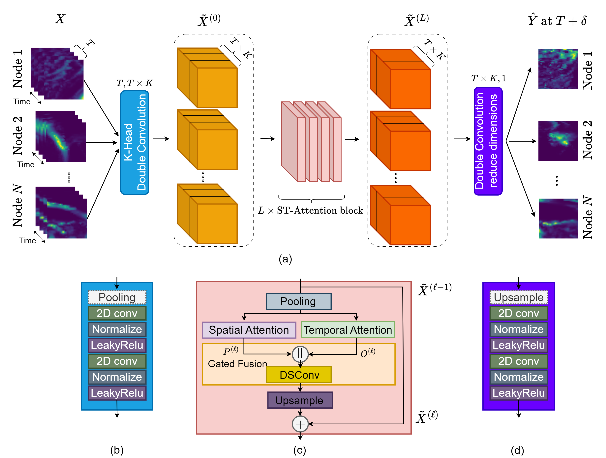
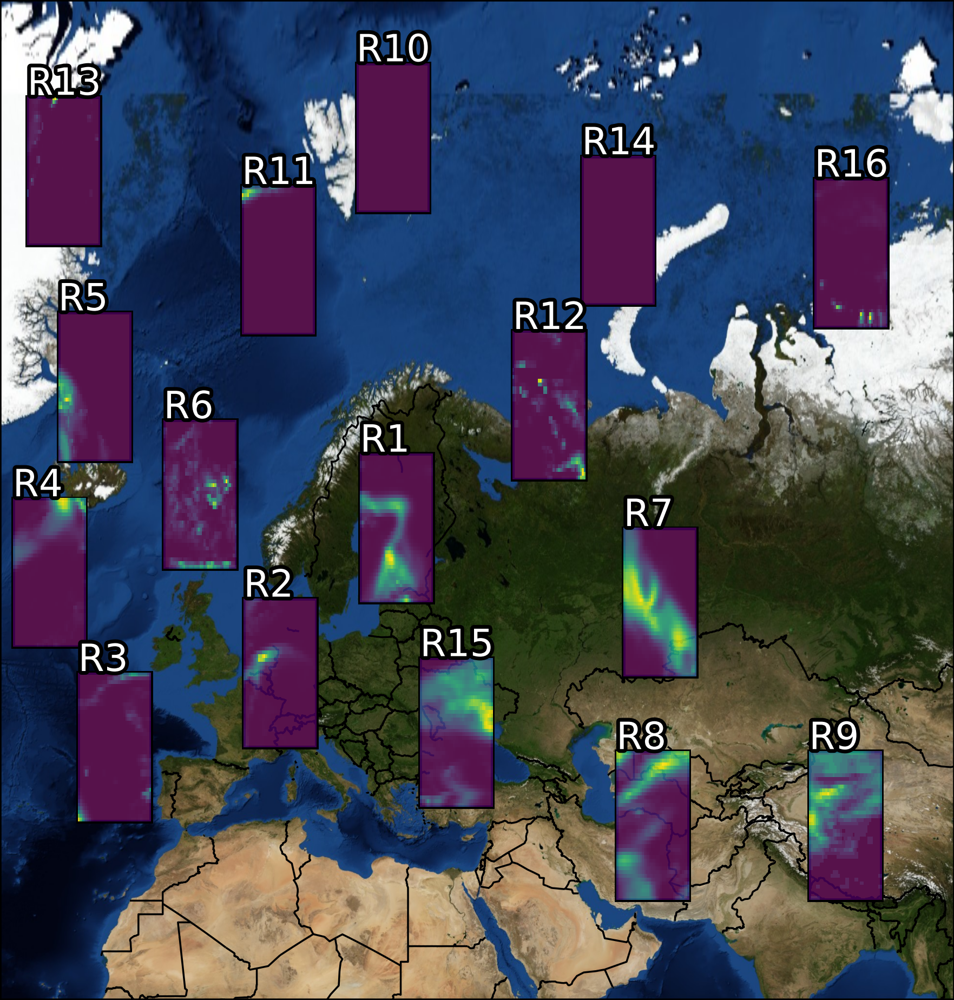

# GD-CAF
Code for the Paper "GD-CAF: Graph Dual-stream Convolutional Attention Fusion for weather nowcasting" [Arxiv-link](https://arxiv.org/abs/2401.07958).





The proposed GD-CAF can be found in the model-folder under [GD-CAF](models/GD-CAF.py).

## Installing dependencies

This project uses [poetry](https://python-poetry.org/) as dependency management. An environment can be created as follows:

```shell
conda create --name gd-caf python=3.9
conda activate gd-caf
poetry install
```
The main packages, which we are using are:
```shell
pytorch
pytorch_lightning
xarray
scipy
tensorboard
tqdm
```

To correctly install PyTorch for gpu, please go to [PyTorch - Get Started](https://pytorch.org-get-started-locally/) for more information.

### Training

For training on the precipitation task we used the [train_precip_lightning.py](train_precip_lightning.py) file.
The training will place a checkpoint file for every model in the `default_save_path`, which is set to `db/trained_models`. After finishing training place the best models (probably the ones with the lowest validation loss) that you want to compare in another folder in `db/checkpoints`.
The [test_precip_lightning.py](test_precip_lightning.py) file is used to test the model from a checkpoint, to do it, call ```eval(path, checkpoint_name)``` function on the desired checkpoint. This will print all metrics also used in the paper. With setting the ```calc_persistence``` flag on, you can also run the persistence prediction alongside the model.

### Precipitation dataset

ERA5 hourly data on single levels from 2016 to 2022 ([link](https://cds.climate.copernicus.eu/cdsapp#!/dataset/reanalysis-era5-single-levels?tab=overview)) was used in this work to gather precipitation data over Europe and its extended regions.

The dataset consists of precipitation maps in 1-hour intervals from 2016-2023 over the selected regions.



If you are interested in the dataset that we used please write an e-mail to: s.mehrkanoon@uu.nl

The datafiles should be put into the corresponding ```data/train/``` and ```data/test/``` folder.

### Citation
```
@misc{vatamany2024gdcaf,
      title={GD-CAF: Graph Dual-stream Convolutional Attention Fusion for Precipitation Nowcasting}, 
      author={Lorand Vatamany and Siamak Mehrkanoon},
      year={2024},
      eprint={2401.07958},
      archivePrefix={arXiv},
      primaryClass={cs.LG}
}
```
